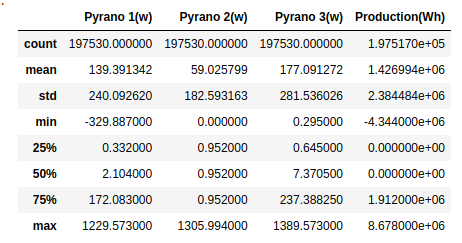

## Analyse de performance de deux centrales solaires 

### Description du projet 
L'objectif du projet est d'analyser la performance de deux centrales solaires (Centrale 1: FRS00171 et Centrale 2: FRS00173) sur plusieur smois.

1) La première a une puissance crête de 10 377,6 kW et utilise trois pyranomètres pour mesurer l’irradiation à différents endroits de la centrale en w.
2) La deuxième a une puissance crête de 2 207,48 kW et utilise deux pyranomètres.

Chacune des deux centrales dispose également d’un système de mesure de la production d’énergie en Wh.
Les données incluent les mesures prises toutes les 5 minutes pour chaque centrale.

### Informations générales 

On a un jeu de données avec 315648 observations. 

Pour la centrale 1 on dispose de 210528 observations sur une période de 01/01/2020 00:05:00 à 01/01/2022 00:00:00.

Pour la centrale 2 on dispose de 105120 observations sur une période de 01/01/2023 00:05:00 à 01/01/2024 00:00:00.

Le tableau d'information nous indique que la colonne DateTime doit être transformée en datetime et qu'il y a des observations manquantes dans les colonnes des pyranomètres et la production. 

#### Centrale 1

#### Centrale 2

Analysant ces deux tables de statistique descriptive, on remarque: 
    
1. Le pyranomètre 2 de la centrale 1 a la même valeur (0.952) pour 3 premiers quartiles donc on peut se demander si la centrale était disfonctionnelle.
2. Le pyranomètre 1 de la centrale 2 le premier quartile a une valeur négative mais normalement la irradiation solaire n'est pas négative donc il s'agit sûrement d'un erreur de mesure.
3. Le pyranomètre 2 de la centrale 2 a la même valeur pour les 2 derniers quartiles (1600), donc de nouveau on peut se demander si la centrale était disfonctionnelle. 
5. Dans les deux cas la production est égale à 0 pour les 2 premiers quartiles.

La visualisation de la production sur au fil du temps pour les deux centrales reconfirme le problème de donées manquantes et aussi des valeurs négatives de production. En plus la production de la centrale 1 durant le mois de juin 2020 semble extrêment basse (peut-être la production n'a été pas bien calculée).

Production Totale : La centrale FRS00171 a une capacité de production maximale bien plus élevée (8 millions de Wh) par rapport à FRS00173 (2 millions de Wh), ce qui pourrait indiquer des différences dans la taille, la technologie ou l'efficacité des centrales.

Stabilité : FRS00173 semble offrir une production plus régulière et sans interruptions majeures, tandis que FRS00171 présente des périodes de non-production significatives, ce qui pourrait suggérer des problèmes de fiabilité ou des intervalles de maintenance plus fréquents.

Saisonnalité : Les deux centrales montrent des signes de saisonnalité, mais celle de FRS00173 est plus apparente et pourrait refléter une utilisation ou une efficacité dépendant des saisons.

### Traitement des doublons et valeurs manquantes 

Lors de l'analyse on a pu identifier des doublons néants qu'on a éliminés. Ensuite les valeurs manquantes nocturnes ont été remplacées par 0 parce que la nuit il n'y a ni irradiation solaire ni production. A partir des données on a défini la période nocturne entre 21h et 6h le matin. Les autres données manquantes ont été remplacées par KNN imputation. C'est une méthode pour combler les valeurs manquantes en utilisant les valeurs des voisins les plus proches. On a utilisé les 3 voisins les plus proches. 

### Identification des valeurs abérrantes 

Pour identifier des valeurs abérrantes on a créé des boxplots par centrale jour et nuit. On a aussi analysé la distribution des moyennes et médiane des pyranomètres par heure. Ci-dessous les boxplots diurnes

#### Centrale 1

#### Centrale 2

A partir des boxplots on a pu constater: 

**Boxplots centrale 1**

Le pyranomètre 1 a des valeurs négatives ce qui n'est pas possible car la irradiation solaire ne peut pas être négative. On remplacera ces valeurs par la valeur positive la plus proche. Pour les valeurs extrêmes on regardera la distribution de l'irradiation solaire plus en détail.

Le pyranomètre 2 a beaucoup de valeurs extrèmes. Cela confirme notre remarque du début, les 3 premiers quartiles ont une valeur constante autour de 1. Donc peut-être le pyranomètre n'a pas bien capté la radition solaire car les autres deux pyranomètres montrent beaucoup plus de variation. Il faut une analyse plus approfondie du pyranomètre 2 et soit ne pas le prendre en compte pour la suite, soit interpoler les valeurs à partir des deux autres pyranomètres.

La production diurne a quelques valeurs négatives ce qui n'est pas possible et donc on remplacera ces valeurs par la valeur positive la plus proche.

La nuit les pyranomètres ont quelques valeurs négatives et positives, on va les remplacer par 0 parce qu'il n'y a ni de irradiation solaire négative ni de irradiation solaire positive lors de la nuit.

La production nocturne a quelques valeurs extrêmes qu'on va également remplacer par 0 parce la nuit les centrales solaires ne produisent pas d'énergie normalement.

**Boxplots centrale 2**

Lors de la journée uniquement le pyranomètre 1 a des valeurs extrêmes. Mais beaucoup moins que celui de la centrale 1. Le pyranomètre 2 ne semble pas avoir de valeurs extrêmes mais il faut garder en tête que les deux derniers quartiles ont la même valeur (1600) et le pyranomètre 1 a des mesures très différents, donc il faut une analyse plus approfondie.

La production diurne n'a pas de valeurs extrêmes.

Par contre la nuit les pyranomètres ont beacoup de valeurs positives qu'on pourra remplacer par 0 car la nuit il n'y a pas de irradiation de soleil. Pareil pour la production, on pourra remplacer les valeurs positives par 0.

Mais d'abord on va regarder la distribution de la moyenne et de la mediane de la irradiation solaire par pyranomètre et par heure.

#### Distribution de la moyenne et de la mediane de la irradiation solaire par pyranomètre et par heure
La moyenne et la médiane de la irradiation solaire par heure du pyranomètre 1 et 3 suivent une distribution normale respectivement pour les deux centrales.

Par contre la médiane de la irradiation solaire par heure du pyranomètre 2 des deux centrales ne suit pas de distribution normale. La médiane suit une distribution unforme. Effectivement, comme mentionné plus haut, on a un problème de valeurs constantes qui pourrait indiquer un disfonctionnement du pyranomètre 2.

#### Centrale 1

#### Centrale 2

Du 01 janvier 2020 jusqu'au 05 mai 2021 (12:25:00) le pyranomètre 2 de la centrale 1 mesure une valeur constante égale à 0.952 w. Donc on peut uniquement prendre en compte les mesures après le 5 mai 2021 (12:25:00).

Du 30 mai 2023 (18:55:00) au 01 janvier 2024 le pyranomètre 2 de la centrale 1 mesure une valeur contante égale à 1600 w. Donc pour la suite de notre analyse, on peut uniquement prendre en compte les mesures avant le 30 mai 2023 (18:55:00).

Il faut prendre ces périodes en compte pour la suite de notre analyse. 

#### Pourcentage des valeurs abérrantes 
#### Centrale 1

#### Centrale 2

### Traitement des valeurs abérrantes 
Les valeurs nocturnes différentes de zéro ont été remplacées par 0 car il n'y a pas d'irradiation ni de production solaire la nuit. 

Les valeurs négatives diurnes ont été remplacées par la valeur positive la plus proche. 

### Recap des défauts du jeu de données

1) La colonne datetime n'était pas au bon format.
2) Il y avait des doublons de dates avec aucune mesure captée (des valeurs NaN).
3) Il avait des données manquantes autour de 5% pour chaque pyranomètre et la production.
4) Plusieurs valeurs abérrantes ont pu être observées:
    - des valeurs d'irradiation solaire négative
    - des valeurs d'irradiation solaire positive la nuit
    - des valeurs constantes sur plusieurs mois mesurées par le pyranomètre 2 des deux centrale
5) La production du mois de juin 2020 de la centrale 1 est extrêment basse 

### Données au pas horaire 

Pour calculer les données au pas horaire, on a tout simplement pris la moyenne par heure des pyranomètres et la somme de la production par heure pour chaque centrale. 

Les pyranomètres mesurent l'irradiance solaire instantanée en watts à chaque intervalle de temps. C'est une mesure de puissance (W), pas d’énergie cumulée.

La production en Wh est une mesure cumulative, c'est pourquoi on a calculé la somme par heure.

### Matrices de corrélation 

Plusieurs matrices de corrélations sont calculés pour les deux centrales. 

1. Centrale 1

Pour la première centrale, une matrice de corrélation pour tous les trois pyranomètres et la production est calculée sur la période où le pyranomètre 2 fonctionne correctement. 

Et une deuxième matrice est calculéé sur toute la période pour le pyranomètre 1 et 3 et la production 

Pyrano 1, 2, et 3 sont fortement corrélés entre eux, avec des coefficients de corrélation entre 0.91 et 0.97. Cela signifie qu'ils capturent de manière cohérente les variations de l’ensoleillement. Vue la correlation élévée entre les pyranomètres c'est tout à fait légitime de prendre en compte qu'un seul pyranomètre pour le performance ratio.

Les corrélations entre chaque pyranomètre et la production sont élevées, notamment pour Pyrano 3 (0.99). Cela indique que la production de la centrale est bien influencée par les mesures de l'irradiation captées par ces pyranomètres, en particulier Pyrano 3, qui semble être un indicateur clé. Donc on va utiliser celui-ci pour le calcul du pr. 

2. Centrale 2 

Pour la deuxième centrale, une matrice de corrélation pour les pyranomètres 1 et 2 et la production est calculée sur la période où le pyranomètre 2 fonctionne correctement. 

Et une deuxième matrice est calculéé sur toute la période pour le pyranomètre 1 et la production 

Pyrano 1 et 2 sont fortement corrélés entre eux, avec des coefficients de corrélation autour de 0.97. Cela signifie qu'ils capturent de manière cohérente les variations de l’ensoleillement. Encore une fois vue la correlation élévée entre les pyranomètres c'est tout à fait légitime de prendre en compte qu'un seul pyranomètre pour le performance ratio.

Les corrélations entre chaque pyranomètre et la production sont élevées, mais vue que seule le pyranomètre 1 fonctionne correctement sur toute la période, on va utiliser celui-ci pour notre analyse. 

### Performance Ratio 

Le Performance Ratio (pr) mesure l'efficacité et la performance d'une centrale solaire. Le pr se calcule de manière suivante: 

    pr = production / (irradiation solaire * puissance crête)

La valeur du pr est comprise entre 0 et 1. Plus la valeur se rapproche de 1, plus la centrale est performante.

On aimerait bien connaître le pr au pas mensuel, pour cela on doit 

1. Aggréger les données au pas mensuel 
2. Convertir la puissance crête de kW en w 

Pour l'irradiation solaire on va prendre les mesures des pyranomètres les plus corrélées avec la production voire ceux qui sont le plus fiable:

Le pyranomètre 3 pour la centrale 1 
Le pyranomètre 1 pour le centrale 2 

On va utiliser les données au pas horaire pour calculer le pr. 

#### Centrale 1

#### Centrale 2

**Explications possibles pour les pr mensuels bas**

- Le mois de juin 2020 a une production extrèmement basse, sûrement la production a été mal captée pour le mois de juin.

- Un quart des valeurs de production diurne de la centrale 1 est égale à 0 et très proche de 0 pour la centrale 2. On peut se demander si cette proportion de 25 % de valeurs nulles dans la production est due à des périodes de faible ensoleillement (par exemple, tôt le matin ou tard le soir), ou bien à des interruptions ou anomalies dans le fonctionnement de l’installation. Il faut vérifier si ces valeurs se concentrent pendant des plages horaires précises. 

- Plage horaire pour la période nocturne choisie est peut-être trop courte

- Irradiation solaire mal mésurée 

- Méthode d'interpolation des données manquantes pas suffisante 
